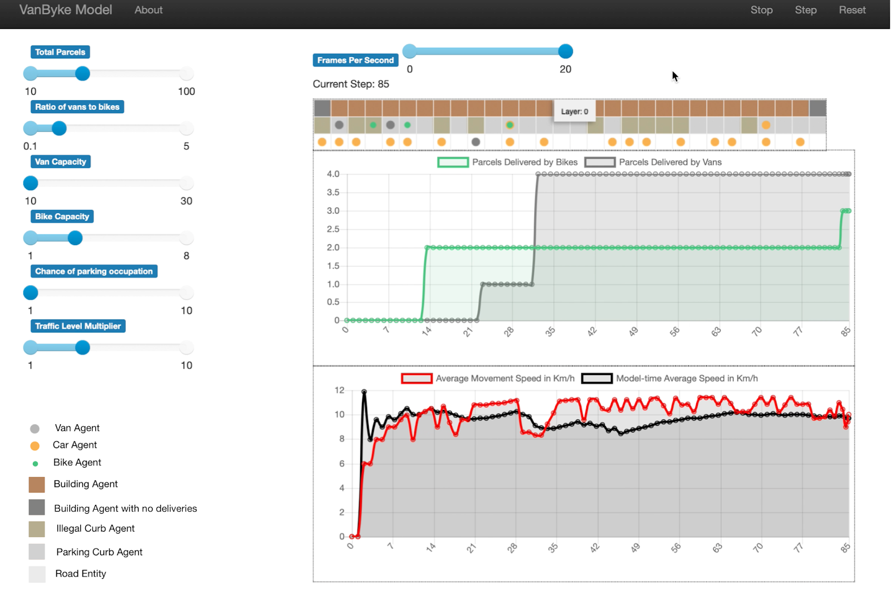
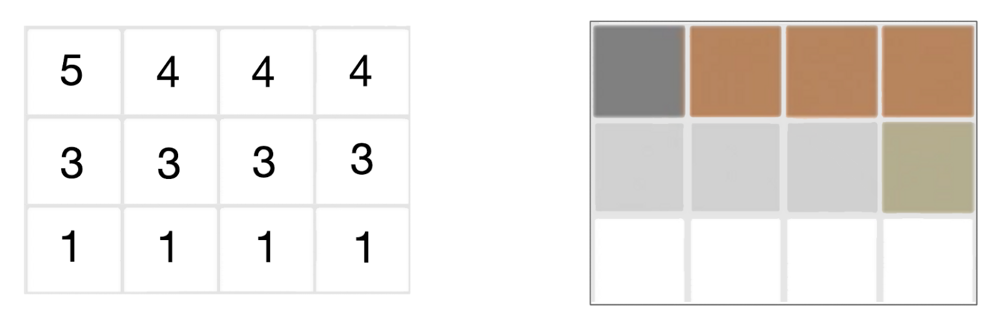

# Agent-Based-Simulation-Model
### Agent Based Simulation Model Created for CASA Dissertation 

My dissertation looked to test the logistical viability of cargo e-bikes as a van replacement in high density urban areas at a micro level through an agent based model built in Python's Mesa library. In particular, the model simulated a single lane road where both vans and cargo bikes delivered parcels. This project was developed in partnership with Tryd.

This is important as there is growing concern about the impact vans have on cities both in terms of traffic and pollution. The model produced presents a minimum baseline of the advantages cargo bikes introduce while also reducing the disadvantages of vans, resulting in a model that should have been drastically more favourable for vans. However, this was not the case and vans only had an advantage in a narrow set of simulations suggesting that a more accurate model should be far more advantageous for cargo bikes. 

This study concludes that cargo bikes are a promising replacement for vans in high density urban areas at the micro level which was tested by the model but their advantages cannot yet be quantified. There are multiple limitations in the model and much research still needs to be done for other environments, but for the one tested, cargo bikes are a viable logistical alternative.

### Model 

In order to test the viability of cargo e-bikes as a van replacement, it was first necessary to design an environment that represents the real world within the scope of this study. It was decided that an agent based model would fit the role best rather than the use of a third party software. This was to ensure complete control over agent behaviour.

In order to assess impact on traffic flow in the model, the average velocity of all driving vehicles, including cargo bikes, in the model environment was used as a key metric. While changing the model parameters, this average velocity will be observed to see the most influential parameters. The main changing parameters that will be looked at are the number of parcels, vans, and bikes in the simulation. These will be looked at different levels of traffic since impact may also vary according to traffic.

### Environment 

The model environment is built according to the road_map.txt. As can be seen in the image below. 1 translates to roads, 3 curbs, 4 delivery destinations, and 5 buildings which are not destinations. The size and proportions of the array also dictates the size and proportions of the model environment. The image below illustrates this. Note that the curb has  different colours to indicate if it is legal or not.

### To Run the Model

Simply download the python notebook and the road_map.txt (or make your own) file in the same directory and run all the cells. The code is commented so that you know what everything does, but many model parameters are customisable even without having to read the code. Simply change the parameters in the model and click reset to save changes. Then click run.

